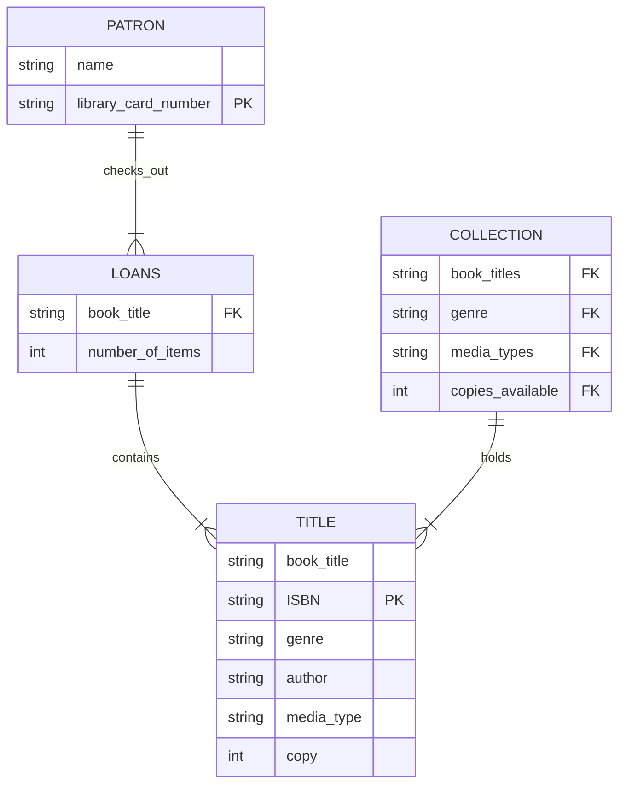

##### Description  
The connections between the data in the tables is described as follows - patrons check out titles (loans) from the larger collection which holds all the titles that the library owns. Between some tables there are shared data points like ISBN, genre, patron etc. but in order for libraries to work some data points have to be really specific so that they can be linked to other non-specific data that you would need to access within a database. For instance, you can have patrons who live in the same house or two titles of the same name, but you need to be able to differentiate them by having a data point that is specific to each. Otherwise it'd be easy mix up titles and users with similar names, genres, authors, etc. So the really important identifiers for libraries are usually ISBN and library card number because they can be made specific to each user or title within the collection. This also makes these numbers unique keys, as they really have to be very specific to the individual you're talking about. 