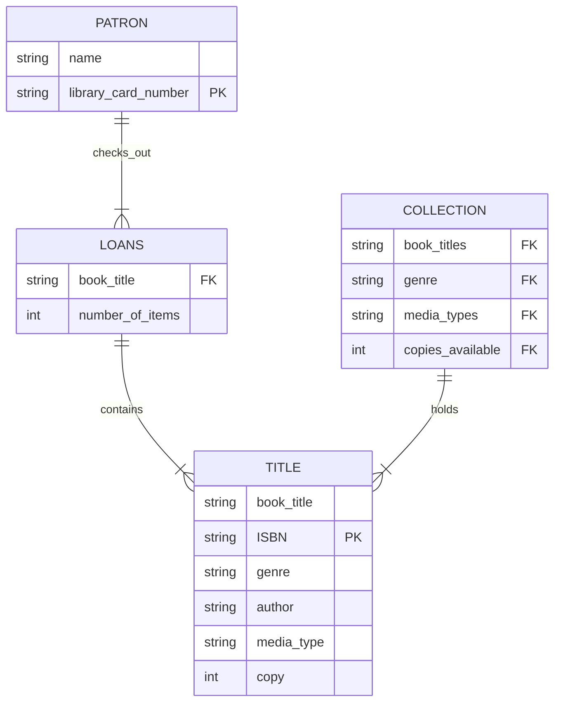

##### Description  
The connections between the data in the tables is described as follows - patrons check out titles (loans) from the larger collection which holds all the titles that the library owns. Between some tables there are shared data points like ISBN, genre, patron etc. that help tie certain identifying information (like genre, title, author, etc.) to a specific user or title. This helps differentiate between patrons that live in the same house or two different pieces of media with the same title. I found that the library database idea was really similar to the the other ERD example, so I followed that instruction sheet primarily to get a sense of what I was creating. I listed the ISBN and library card numbers as Primary Keys because these points of information are important to tying you to other relevant/identifying information about a piece of data. Otherwise you really don't have access to who you're checking out to/what you're checking out. I also listed the titles, genre, media type, and copy as Foreign Keys in the Collection table just because it seems that those are data points that would have to be pulled from other areas rather than just coming from the table itself.